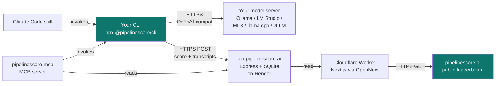

<div align="center">

# PipelineScore

**Benchmark LLMs on YOUR hardware.** Same 25 standardized tasks, deterministic 0–100 score, your environment. The only public LLM leaderboard that ranks where the model runs — not just which model it is.

[](https://pipelinescore.ai)
[](LICENSE)
[](https://www.typescriptlang.org/)
[](https://github.com/drewmattie-code/pipelinescore/stargazers)
[](https://github.com/drewmattie-code/pipelinescore/issues)
[](https://pipelinescore.ai/run)

[**Live leaderboard**](https://pipelinescore.ai) · [**Methodology**](https://pipelinescore.ai/methodology) · [**Privacy / BYOK posture**](https://pipelinescore.ai/privacy) · [**Run the CLI**](https://pipelinescore.ai/run)

</div>

---

## What it looks like

```text
$ npx @pipelinescore/cli run \
    --provider local --endpoint http://localhost:11434 \
    --model llama-3.3-70b --hardware-tag m3-max-128gb \
    --user your-handle

╭ PipelineScore v0.1.0 ──────────────────╮
│ Provider:     local                    │
│ Model:        llama-3.3-70b            │
│ Hardware:     m3-max-128gb             │
│ Config tag:   — (base model)           │
│ User:         your-handle              │
│ Submit:       yes                      │
╰────────────────────────────────────────╯

Fetched testpack 2026-05-24-v1 from backend.
Running 25 tasks ... ████████████████████ 25/25

╭──────────────────── PipelineScore ─────────────────────╮
│                                                        │
│   78.4   MAINLINE                                      │
│   ────                                                 │
│                                                        │
│   code ████████░░  79.1     tool_use ██████░░░░  61.4  │
│   reason ███████░░ 75.8     rag      ████████░░  82.6  │
│   write ████████░░ 81.2     speed    █████░░░░░  52.3  │
│                                                        │
│   Total tokens: 4,827 · Avg latency: 712ms             │
│   See your run: pipelinescore.ai/users/your-handle     │
╰────────────────────────────────────────────────────────╯

Opening your leaderboard page in your browser.
```

## Quickstart — local model (30 seconds)

If you have Ollama / LM Studio / MLX / llama.cpp running:

```bash
npx @pipelinescore/cli run \
  --provider local \
  --endpoint http://localhost:11434 \
  --model llama-3.3-70b \
  --hardware-tag m3-max-128gb \
  --user your-handle
```

Swap port for LM Studio (`1234`), llama.cpp (`8080`), MLX-Omni (`10240`), or LiteLLM proxy (`8000`). Replace `m3-max-128gb` with your rig (`rtx-4090-24gb`, `ryzen-7950x-cpu-only`, `a100-80gb`, anything alphanum + `. _ -`).

The CLI runs locally, calls your model server, scores the output, and publishes the result to https://pipelinescore.ai/users/your-handle.

## Quickstart — frontier API (BYOK)

```bash
ANTHROPIC_API_KEY=sk-... npx @pipelinescore/cli run \
  --provider anthropic --model claude-opus-4-7 \
  --user your-handle
```

Or `--provider openai`. **Your key never reaches our backend** — it goes directly to the provider. See [Privacy](https://pipelinescore.ai/privacy) for the full data-flow.

## Why this leaderboard exists

Every other ranked LLM list ignores the rig:

| | Hardware-aware? | You can run it yourself? | Local-model coverage | Reproducible | Open source |
|---|:---:|:---:|:---:|:---:|:---:|
| **PipelineScore** | ✅ | ✅ | ✅ | ✅ | ✅ Apache 2.0 |
| LMArena | ❌ | ❌ (preference votes only) | partial | ❌ | partial |
| Artificial Analysis | ❌ | ❌ (centrally run) | partial | ❌ | ❌ |
| lm-evaluation-harness | ❌ | ✅ | ✅ | ✅ | ✅ MIT |
| MMLU / SWE-Bench / TerminalBench | ❌ | ✅ | ✅ | ⚠️ test set leaks fast | ✅ |
| OpenLLM Leaderboard (HF) | ❌ | ❌ | ✅ | ✅ | ✅ |

**The missing axis is the hardware tag.** Same Llama 4 on an M3 Max vs an RTX 4090 vs an A100 produces three very different real-world experiences. Same RTX 4090 with three different models produces three apples-to-apples comparisons. The benchmark is reproducible, the hardware tag is preserved, the score lands on a public, searchable leaderboard at https://pipelinescore.ai/leaderboard/users.

## Architecture



**Three integration paths** to drive the CLI:
1. **Manual** — copy/paste the `npx` command into your terminal
2. **Skill** — drop [`SKILL.md`](dist/skills/pipelinescore/SKILL.md) into `~/.claude/skills/` and your AI runs it for you
3. **MCP** — install [`@pipelinescore/mcp`](mcp/) and any MCP-compatible client (Claude Code, Cursor, Codex, Continue, Cline) gets the benchmark as a tool

**Backend never sees your API key.** When `--provider anthropic/openai`, the CLI calls the provider directly. Only the score + transcripts (with API keys stripped) reach our backend. See [SECURITY.md](SECURITY.md) for the full posture.

## What's here

```
pipelinescore/
├── docs/superpowers/specs/    Design spec (245-line v1)
├── benchmarks/                Taxonomy (categories, weights, tiers) + 25 v1 tasks (JSON)
├── web/                       Next.js 16 marketing site (port 4600)
├── backend/                   Express + SQLite API (port 4601)
├── cli/                       Node TypeScript CLI tool (`ps-bench`)
└── assets/hero/               Hero imagery (generated via nano-banana)
```

## Quick start

You need three terminals:

### 1. Backend (Express + SQLite, port 4601)
```bash
cd backend
npm install
npm run dev
```

On first boot it auto-migrates and seeds the database (`~/Projects/pipelinescore/backend/.data/pipelinescore.db`) with 10 reference models + 120 sample submissions across realistic hardware tags. Verify:
```bash
curl http://localhost:4601/health
curl http://localhost:4601/v1/leaderboard | jq '.entries[:5]'
```

### 2. Web (Next.js 16, port 4600)
```bash
cd web
npm install
npm run dev
```

Then open http://localhost:4600. Seven routes live:
- `/` — homepage with hero
- `/leaderboard` — full ranked table
- `/models/[slug]` — per-model detail
- `/compare/[a]/[b]` — head-to-head
- `/methodology` — how the score works
- `/run` — get-started instructions
- `/about` — what + who

### 3. CLI (run a real benchmark)
```bash
cd cli
npm install
export ANTHROPIC_API_KEY=sk-ant-...
npx tsx src/index.ts run --provider anthropic --model claude-haiku-4-5-20251001
```

The CLI fetches the day's signed test pack from `:4601/v1/testpack`, calls your chosen LLM for each task, judges responses (deterministic test cases or Claude Haiku 4.5 rubric), computes the weighted **PipelineScore**, and prints a result card:

```
╭──────────────────────────────────╮
│ PipelineScore: 86.0 — MAINLINE   │
│ Model: claude-haiku-4-5-20251001 │
│                                  │
│ Code     ██████████   96.0       │
│ Reason   ██████░░░░   60.0       │
│ Write    ██████████   98.0       │
│ Tool Use ████████░░   80.0       │
│ RAG      ██████████  100.0       │
│ Speed    █████████░   86.9       │
╰──────────────────────────────────╯
```

Other providers wired:
- `--provider openai --model gpt-4o-mini` (uses `OPENAI_API_KEY`)
- `--provider local --model llama-3.3-70b --endpoint http://localhost:11434` (Ollama default; works with LM Studio, llama.cpp, MLX-Omni, LiteLLM)

## The score

| Category | Weight | What it tests |
|---|---|---|
| **Code** | 25% | Generation, debugging, refactoring, test writing |
| **Reason** | 20% | Multi-step reasoning, math, logic, instruction following |
| **Write** | 15% | Drafting, summarization, style adherence |
| **Tool Use** | 15% | Function-call correctness, parameter selection, schema fitting |
| **RAG** | 12% | Grounded answers, citation accuracy, no hallucination |
| **Speed** | 13% | p50 latency + tokens/sec under standardized load |

5 tasks per category. Score = Σ (category_score × weight). One headline number (0–100), category breakdown underneath.

## Tier system

| Range | Tier | |
|---|---|---|
| 90–100 | **TRUNK** | 🟢 Main industrial pipeline — top |
| 75–89 | **MAINLINE** | 🔵 Main service line — excellent |
| 60–74 | **FEEDER** | 🟠 Secondary line — solid |
| 40–59 | **TAP** | 🟧 Small branch — functional |
| 0–39 | **DRIP** | ⚪ Minimal flow — weak |

## Anti-cheat

- Public taxonomy (categories + sample prompts), private test pack (rotated daily, HMAC-signed).
- Server-side re-judgment using a held-out judge model (Claude Haiku 4.5).
- Rate limits (max 10 submissions/day per IP/user).
- Lab-verified flag on submissions re-run centrally.

## Roadmap

**v1 (current):** local-only stack. 25 tasks across 5 task categories + speed measured during execution. Apple-flavored marketing site. CLI ships against Anthropic + OpenAI + local (OpenAI-compatible).

**v2:**
- Custom-deployment comparison (compare your fine-tune or prompt-tuned setup to stock models).
- Full SEO long-tail (every model + every comparison auto-generates a page).
- OG image per submission for share-card virality.
- Cloud deployment (Cloudflare Pages for web, Render/Fly for backend).
- Dataset growth from 25 → 100+ tasks.

**v3:**
- Multimodal (image, audio).
- Sponsored leaderboard slots from model providers.
- Enterprise tier for testing custom internal deployments.

## Tech stack

- **Web**: Next.js 16 (App Router), React 19, TypeScript 5, Tailwind 4, SVG charts.
- **Backend**: Express, TypeScript, better-sqlite3, Zod, HMAC for testpack signing.
- **CLI**: Node 22, TypeScript, Commander, Chalk, Boxen, cli-progress.
- **Benchmark judging**: deterministic Python execution + Claude Haiku 4.5 for rubric tasks.

## Data + retention policy

PipelineScore is a public benchmark. Submissions become part of the public leaderboard by design. To keep that responsible, the backend enforces a hard retention policy.

### What is stored permanently
- Model identity (slug, provider, family, released_at)
- Pipeline score + tier + per-category scores
- User nickname (the one you set with `--user`)
- Submission timestamp + lab-verified flag
- Optional config tag (LoRA / system-prompt / persona / etc.)
- CLI version that submitted

### What is stored for 30 days only
- Raw prompt transcripts (`submissions.raw_transcripts`)
- Per-task `task_input` (the prompt) and `model_output` (what the model said)
- Judge rationales

After 30 days these fields are overwritten with `[redacted:30d_ttl]`. The score row stays — only the body of the run is removed. Rationale: users sometimes submit prompts/outputs containing PII, API keys, or internal docs without realizing. Keeping the bodies indefinitely would compound risk every day.

### What is stored for 90 days
- Request event log (`events` table) — method, path, status, latency, IP, user-agent, nickname-if-known
- Used for product analytics, abuse detection, and aggregated reporting
- No request bodies are stored
- Cleared on a rolling 90-day window

### What is never stored
- API keys (CLI calls your provider directly with your key; the backend never sees it)
- Request or response payloads beyond the fields listed above
- Personal information beyond the nickname you explicitly chose

### Enforcement
A background job (`backend/src/lib/retention.ts`) runs on startup and every hour:
- Redacts transcripts on submissions older than 30 days
- Deletes event-log rows older than 90 days
- Logs how many rows were touched

You can verify by inspecting `submissions.raw_transcripts` (look for `"redacted":true`) or by querying the `events` table.

### Rate limits
- 200 reads / IP / minute
- 20 submits / IP / hour
- 100 submits / nickname / day
- 5 submits / (nickname, model) / hour

When a limit is hit you get a `429` + RFC-standard `RateLimit-*` headers + a stamped JSON error body identifying which layer fired.

## Contributing

We need help with:
- **More benchmark tasks** — submit a PR with a task in `benchmarks/tasks-v1.json`
- **More local server endpoints** — vLLM, TGI, Ramalama, anything OpenAI-compatible
- **Hardware tag suggestions** — common rigs we're missing in [seed-local-models.ts](backend/src/seed-local-models.ts)
- **Bug reports** — file an issue with the failing nickname / model / hardware combo

See [CONTRIBUTING.md](CONTRIBUTING.md) for the workflow + [SECURITY.md](SECURITY.md) for the BYOK posture.

## Star History

[](https://star-history.com/#drewmattie-code/pipelinescore&Date)

If this repo is useful to you, a star is the easiest signal to send. It helps surface PipelineScore to other devs running local models.

## License

[Apache 2.0](LICENSE).

## Authors

Drew Mattie (Charles & Roe Inc.)
