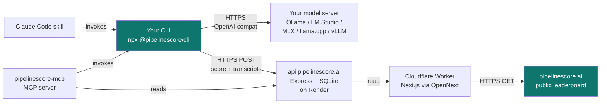

<div align="center">

# PipelineScore

**Benchmark LLMs on YOUR hardware.** Same 34 deterministic tasks, scored entirely on your machine — no judge model, no API key — one 0–100 score. The only public LLM leaderboard that ranks where the model runs — not just which model it is.

[](https://pipelinescore.ai)
[](https://www.npmjs.com/package/@pipelinescore/cli)
[](LICENSE)
[](https://www.typescriptlang.org/)
[](https://github.com/drewmattie-code/pipelinescore/stargazers)
[](https://github.com/drewmattie-code/pipelinescore/issues)
[](https://pipelinescore.ai/run)

[**🚀 Live at pipelinescore.ai**](https://pipelinescore.ai)

[Live leaderboard](https://pipelinescore.ai/leaderboard/users) · [Methodology](https://pipelinescore.ai/methodology) · [Privacy / BYOK posture](https://pipelinescore.ai/privacy) · [Run the CLI](https://pipelinescore.ai/run)

[](https://pipelinescore.ai/leaderboard/hardware)

</div>

---

## What it looks like

Real output — an M5 Max MacBook running gpt-oss-20b through LM Studio:

```text
$ npx @pipelinescore/cli run \
    --provider local --endpoint http://localhost:1234/v1 \
    --model openai/gpt-oss-20b --user drew

╭────────────────────────────────────────────────╮
│ PipelineScore v0.4.0                           │
│ Provider:     local                            │
│ Model:        openai/gpt-oss-20b               │
│ Hardware:     m5-max-48gb (auto-detected)      │
│ Config tag:   — (base model, no customization) │
│ User:         drew                             │
│ Submit:       yes                              │
╰────────────────────────────────────────────────╯
Using bundled testpack 2026-06-10-v3.
Running 34 tasks locally. No API key needed — every task is scored on your machine.

╭──────────────────────────────────────────────╮
│ PipelineScore: 93.2 — TRUNK                  │
│ Model: openai/gpt-oss-20b                    │
│                                              │
│ Code     ██████████  100.0                   │
│ Reason   ████████░░   80.0                   │
│ Tool Use █████████░   87.5                   │
│ RAG      ██████████  100.0                   │
│ Speed    ██████████   99.3                   │
│                                              │
│ View card: https://pipelinescore.ai/s/68cd…  │
╰──────────────────────────────────────────────╯
See your run: https://pipelinescore.ai/users/drew
Useful? A star helps others find it: https://github.com/drewmattie-code/pipelinescore ★
```

## Quickstart — zero config (10 seconds)

```bash
npx @pipelinescore/cli
```

That's it. The CLI finds your local server (Ollama, LM Studio, llama.cpp, MLX-Omni, vLLM/LiteLLM), lists the models it's actually serving, asks for an optional leaderboard nickname, auto-detects your hardware, and runs.

## Quickstart — explicit flags

```bash
npx @pipelinescore/cli run \
  --provider local \
  --endpoint http://localhost:11434/v1 \
  --model llama3.2 \
  --user yourname   # optional — omit to stay anonymous
```

Every common local server keeps its OpenAI-compatible API under `/v1` — Ollama (`11434`), LM Studio (`1234`), llama.cpp (`8080`), MLX-Omni (`10240`), LiteLLM (`4000`). Your hardware tag is **auto-detected** (`m5-max-48gb`, `rtx-4090-24gb`, …); pass `--hardware-tag` only when the model executes on a different machine than the CLI.

## Quickstart — frontier API (BYOK)

```bash
ANTHROPIC_API_KEY=sk-... npx @pipelinescore/cli run \
  --provider anthropic --model claude-opus-4-7
```

Or `--provider openai`. **Your key never reaches our backend** — it goes directly to the provider. See [Privacy](https://pipelinescore.ai/privacy) for the full data-flow.

## Why this leaderboard exists

Every other ranked LLM list ignores the rig:

| | Hardware-aware? | You can run it yourself? | Local-model coverage | Reproducible | Open source |
|---|:---:|:---:|:---:|:---:|:---:|
| **PipelineScore** | ✅ | ✅ | ✅ | ✅ | ✅ Apache 2.0 |
| LMArena | ❌ | ❌ (preference votes only) | partial | ❌ | partial |
| Artificial Analysis | ❌ | ❌ (centrally run) | partial | ❌ | ❌ |
| lm-evaluation-harness | ❌ | ✅ | ✅ | ✅ | ✅ MIT |
| MMLU / SWE-Bench / TerminalBench | ❌ | ✅ | ✅ | ⚠️ test set leaks fast | ✅ |
| OpenLLM Leaderboard (HF) | ❌ | ❌ | ✅ | ✅ | ✅ |

**The missing axis is the hardware tag.** Same Llama 4 on an M3 Max vs an RTX 4090 vs an A100 produces three very different real-world experiences. Same RTX 4090 with three different models produces three apples-to-apples comparisons. The benchmark is reproducible, the hardware tag is preserved, the score lands on a public, searchable leaderboard at https://pipelinescore.ai/leaderboard/users.

## Architecture



**Three integration paths** to drive the CLI:
1. **Manual** — copy/paste the `npx` command into your terminal
2. **Skill** — drop [`SKILL.md`](web/public/skills/pipelinescore/SKILL.md) into `~/.claude/skills/` and your AI runs it for you
3. **MCP** — install [`@pipelinescore/mcp`](mcp/) and any MCP-compatible client (Claude Code, Cursor, Codex, Continue, Cline) gets the benchmark as a tool

**Backend never sees your API key.** When `--provider anthropic/openai`, the CLI calls the provider directly. Only the score + transcripts (with API keys stripped) reach our backend. See [SECURITY.md](SECURITY.md) for the full posture.

## The score

Five deterministic categories — code (executed), reason (exact-match), tool use + RAG (JSON-match), speed (measured throughput) — weighted to mirror real LLM usage. One headline number (0–100), category breakdown underneath. Score maps to one of five tiers — TRUNK / MAINLINE / FEEDER / TAP / DRIP — for at-a-glance readability.

Full methodology + weights + anti-cheat: [pipelinescore.ai/methodology](https://pipelinescore.ai/methodology)

## Deeper documentation

This README is the front door. For specifics:

| | Where |
|---|---|
| 🤖 LLM-first usage guide | [AGENTS.md](AGENTS.md) |
| 🛠️ Local dev setup (backend + web + CLI) | [DEVELOPMENT.md](DEVELOPMENT.md) |
| 🛡️ BYOK posture + retention policy | [SECURITY.md](SECURITY.md) + [pipelinescore.ai/privacy](https://pipelinescore.ai/privacy) |
| 🧮 How scores are computed + anti-cheat | [pipelinescore.ai/methodology](https://pipelinescore.ai/methodology) |
| 🤝 Contributing | [CONTRIBUTING.md](CONTRIBUTING.md) |
| 📜 Changelog | [CHANGELOG.md](CHANGELOG.md) |
| 🗣️ Code of conduct | [CODE_OF_CONDUCT.md](CODE_OF_CONDUCT.md) |

## Contributing

We need help with:
- **More benchmark tasks** — submit a PR with a task in `benchmarks/tasks-v1.json`
- **More local server endpoints** — vLLM, TGI, Ramalama, anything OpenAI-compatible
- **Hardware tag suggestions** — common rigs we're missing in [seed-local-models.ts](backend/src/seed-local-models.ts)
- **Bug reports** — file an issue with the failing nickname / model / hardware combo

See [CONTRIBUTING.md](CONTRIBUTING.md) for the workflow + [SECURITY.md](SECURITY.md) for the BYOK posture.

## Star History

[](https://star-history.com/#drewmattie-code/pipelinescore&Date)

If this repo is useful to you, a star is the easiest signal to send. It helps surface PipelineScore to other devs running local models.

## License

[Apache 2.0](LICENSE).

## Authors

Drew Mattie · SaaSquach AI Labs (a division of Charles & Roe Inc.)
